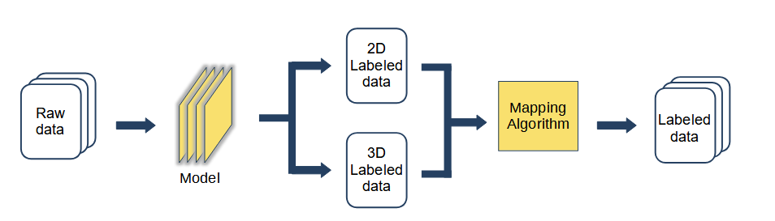

# Auto_Labeling
#### Purpose
- 訓練深度學習模型需要大量的資料集，但蒐集和標註資料既耗時又費力。我開發了一套自動化標註（Auto-Labeling）的技術，能夠同時標註2D和3D資料，大幅減少人工標註的時間和成本。這套技術能高效地處理和標註大量資料集，顯著提升效率並降低成本​。
#### Method
- Box-Attention for 2D and 3D Transformers，

    https://doi.org/10.48550/arXiv.2111.13087

    https://github.com/kienduynguyen/BoxeR

#### Flow Chart 


#### Description
- 首先，2D影像作為輸入，並輸出物件的2D邊界框(Bounding box)和類別(Class)。接著，3D以點雲(Point cloud)作為輸入，輸出物件的3D邊界框、類別，並通過演算法計算物件距離(Distance)。最後，將這些輸出資訊進行匹配(Mapping)，生成帶有完整標註資訊的資料集。


## 2D Object Detection

### Modifications
```
- Learning Rate (Warm up) (Multi-step -> Cosine annealing -> LR Damping)
- Data Augmentation
- Hard Example Mining
- Loss Function (GIoU -> CIoU) (Focal loss -> Dynamical FL)
- Architecture (Encoder & Decoder layer)
```

### Performance
#### FoV24
|     Bbox     |   Precision   |   Recall   | F1 Score | FPS  |
|--------------|:-------------:|:----------:|:--------:|:----:|
|   Original   |     88.8%     |    90.9%   |   0.899  |
| Augmentation |     89.7%     |    90.6%   |   0.901  |
| Architecture |     89.1%     |    91.1%   |   0.902  |
|     CIoU     |     89.4%     |    91.0%   |   0.902  |
|Cos annealing |     89.8%     |    91.5%   |   0.906  |
| Dynamical FL |     90.2%     |    91.3%   |   0.908  |
|  LR Damping  |     92.2%     |    90.1%   |   0.911  | 41.7 |

#### FoV50
| Precision | Recall | F1 Score |
|:---------:|:------:|:--------:|
|   90.4%   | 80.7%  |   0.853  |

### Ineffective
- Activation function (ReLu -> GeLu) 
- wight map (Edge detection soble)(Feature extraction)

## 3D Object Detection
### Preprocessing
```
Waymo dataset
- Switch label ("Pedestrian", “Cycle”, “Car”)
- Crop FoV (FoV 50)
- Downsampling point cloud (64 beams - 32 beams)
- Remove redundant data (Bbox_point < 5 、Elongation/Intensity )

Compal dataset
- Switch label (Pedestrian, Cycle/Motorcycle -> Cycle, Car/Bus/Truck -> Car)
- Crop FoV (FoV 50)
- Change point feature [x, y, z, 0, 0]
- Convert data format (Input : bin to plk、Output : bin to xml)
```

### Performance

|  Bbox    |   Precision   |   Recall   | F1 Score | FPS  |
|----------|:-------------:|:----------:|---------:|-----:|
| Waymo    |     46.3%     |   45.8%    |   0.460  |
| Our      |     78.8%     |   71.7%    |   0.751  |

## Other Algorithm

### Distance
#### Purpose
- 計算出物件在世界座標下的距離
#### Method
- Orthogonal Projection Onto a Line
---
### Mapping
#### Purpose
- 將2D跟3D的output Bbox匹配起來
#### Method
- Lidar to image (Extrinsic & Intrinsic matrix 、Distortion coefficient)
- Hungarian Algorithm (Cost matrix : IoU)
---
### Visualization
#### Purpose
- Demo 2D/3D 預測的結果，以利更直觀分析結果和修正模型
#### Method
- OpenCV
- Matplotlib
- Open3d
---
### Evaluation
#### Purpose
- 計算 2D/3D inference 的 Precision/Recall/F1 Score
#### Method
- IoU (2D : area / 3D : volume)
---
