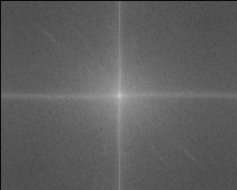
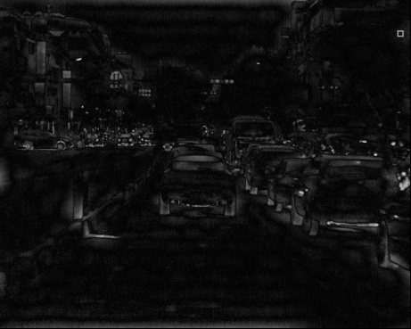

# Filter Algorithm
## Purpose
- 在ADAS物件偵測模型推論前，先對影像進行過濾，當影像朦朧或物件邊緣模糊，導致影像失效時，演算法將發出警報。
## Method
### The basic approach
```
 1. 將影像透過快速傅立葉轉換(FFT)到頻率域。
 2. 透過方形遮罩將低頻濾除（高通濾波器HPF）。
 3. 再透過傅立葉逆轉換(iFFT)回空間域。
 4. 由於返回的數值為複數，因此取絕對值。
 5. 最後對整張影像取變異數(Variance)。
 6. 對變異數進行統計分析，並取得閾值(Threshold)。
 ```

 -
 - 



### Algorithm Decision Process
```
>> Parameters
- Mask Size (20 x 20)
- Threshold (Blurry : variance < 11.7)

>> First stage : 
    - Analyze the entire image

>> Second stage: 由於大量地面容易造成影像數值過於均勻
    - Analyze the top two-thirds of the image

>> The final stage : 使演算法更精準
    - 透過滑動窗口(Slid Windows)的方式，設定連續出現清晰或模糊2秒後，才改變輸出
```

### Other approaches
- K-means : 無法足夠有效的區分清晰與模糊。
- Mean/Variance : 原始影像非一般熱值圖，經過後處理後，清晰與模糊無明確規律。
- Edge detection(Canny、Laplacian、Sobel) : 能夠做到，但效果沒有FFT好。
 
## Performance
(1) Rain / Day / Highway 

(2) Rain / Day / Mountain

|     |  Recall  |   Blurry  |  Total  |
|-----|:--------:|:---------:|:-------:|
| (1) |  91.6%   |    153    |   167   |
| (2) |   100%   |    187    |   187   |

## Flow Chart 
